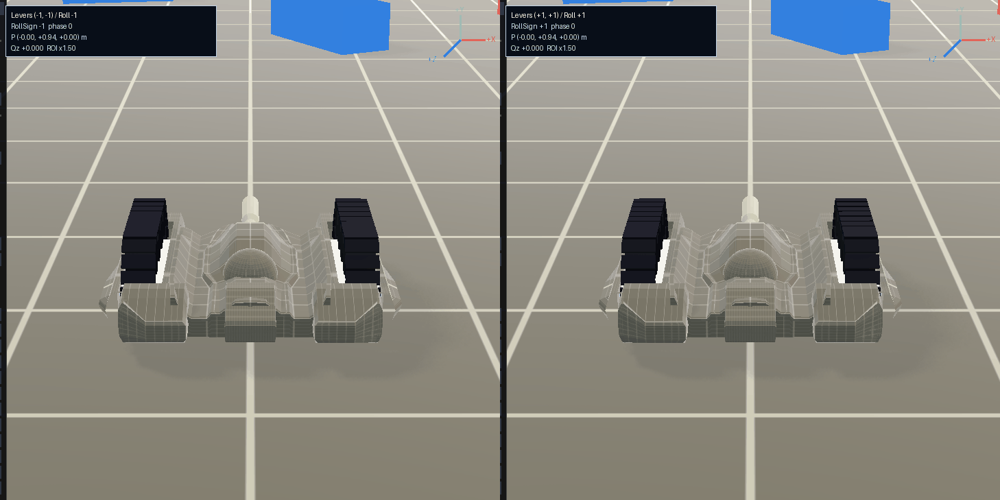
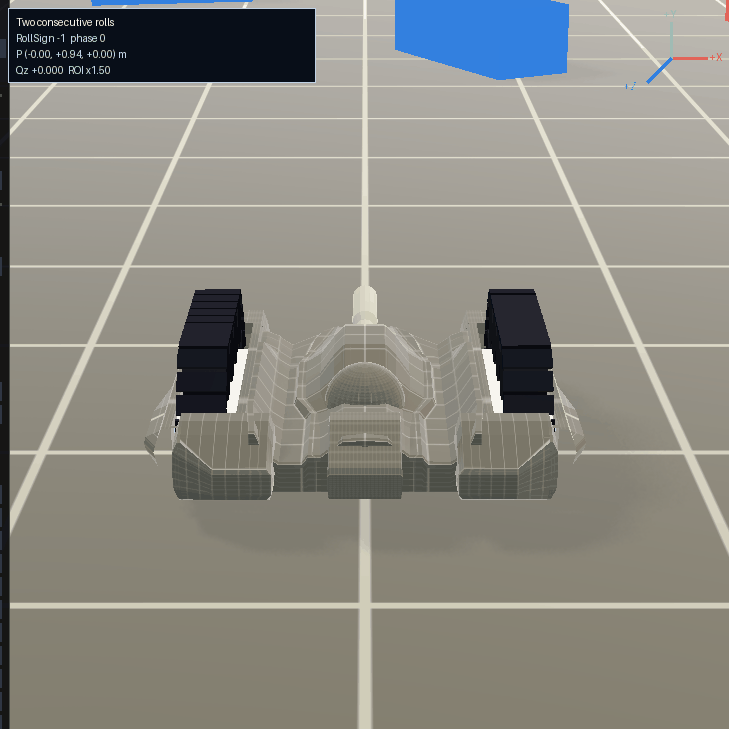

# Rolling Animation GIF Gallery

GitHub に公開済みの、TankSandbox のローリング挙動を実機レンダラで確認した
アニメーション GIF の一覧です。各サムネイルを選ぶと、元の GIF を開けます。

| 日付 | 実験 | GIF |
| --- | --- | --- |
| 2026-09-08 | ローリング画面キャプチャの初期確認。車体周辺を切り出す ROI と座標軸の重畳表示を確認。 |  |
| 2026-09-10 | 二連続ローリングの実機キャプチャ。1回目の着地後、入力ラッチが復帰した時点で2回目のレバー入力を受け付けることを確認。 |  |
| 2026-09-10 | 着地後の二連続ローリング。回転トルクを15%下げた調整値で、横移動と着地を確認。 |  |
| 2026-09-10 | 90°到達時の逆入力で `ReturnToStart` を選び、開始姿勢・開始位置へ戻ることを確認した実機キャプチャ。これは75°受付への変更前の記録。 |  |

## Notes

- GIF 内の `+X`、`+Y`、`+Z` は TankSandbox の DirectX 左手系座標規約です。
- 本一覧は公開済みの履歴を保つためのものです。現在の仕様では、逆入力の受付開始角は 75° です。
